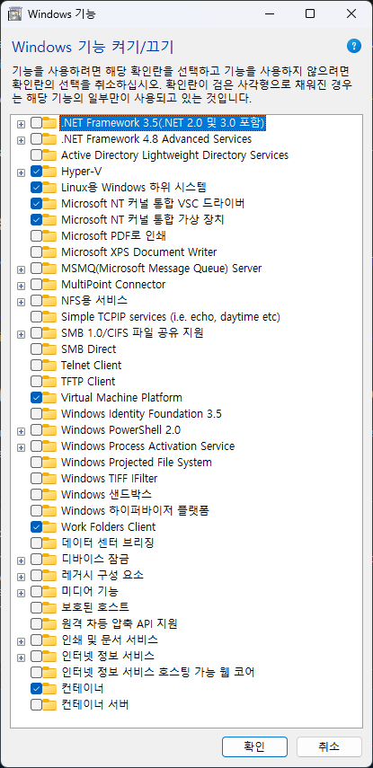
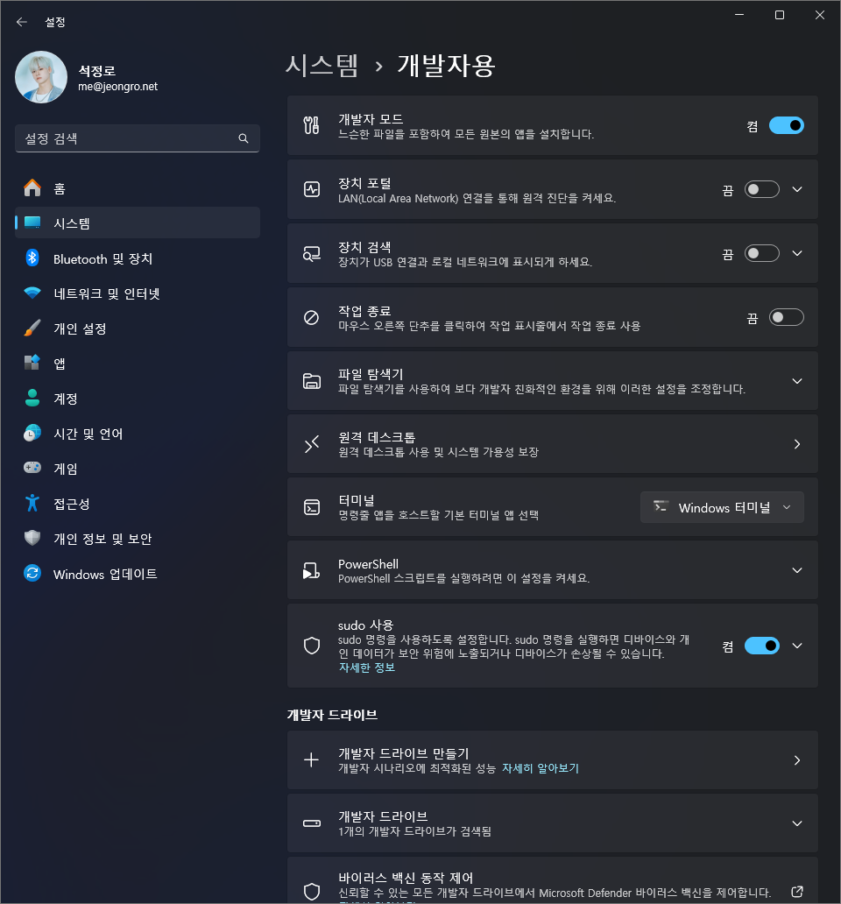
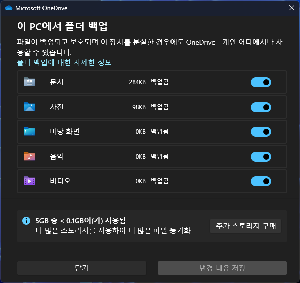
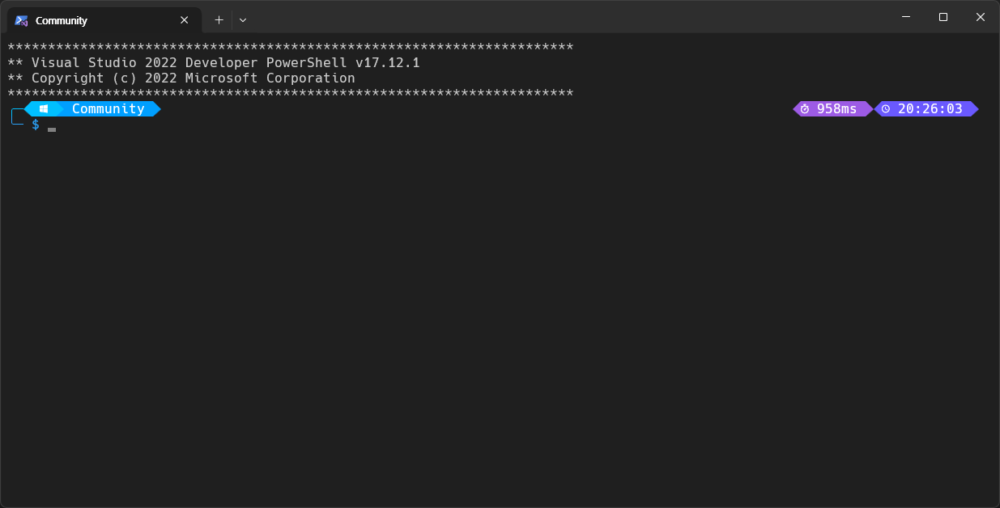

# 나만을 위한 개발환경 구성

## Windows 11 Pro

```sh
SYSTEMINFO
```

| 호스트 이름             | WS-NA-1                                                                                                                                                                                                                                                                                                                                                                                          |
| ----------------------- | ------------------------------------------------------------------------------------------------------------------------------------------------------------------------------------------------------------------------------------------------------------------------------------------------------------------------------------------------------------------------------------------------ |
| OS 이름                 | Microsoft Windows 11 Pro                                                                                                                                                                                                                                                                                                                                                                         |
| OS 버전                 | 10.0.26100 N/A 빌드 26100                                                                                                                                                                                                                                                                                                                                                                        |
| OS 제조업체             | Microsoft Corporation                                                                                                                                                                                                                                                                                                                                                                            |
| OS 구성                 | 독립 실행형 워크스테이션                                                                                                                                                                                                                                                                                                                                                                         |
| OS 빌드 종류            | Multiprocessor Free                                                                                                                                                                                                                                                                                                                                                                              |
| 시스템 제조업체         | Micro-Star International Co., Ltd.                                                                                                                                                                                                                                                                                                                                                               |
| 시스템 모델             | MS-7B89                                                                                                                                                                                                                                                                                                                                                                                          |
| 시스템 종류             | x64-based PC                                                                                                                                                                                                                                                                                                                                                                                     |
| 프로세서                | 프로세서 1개 설치됨,[01]: AMD64 Family 23 Model 113 Stepping 0 AuthenticAMD ~3600Mhz                                                                                                                                                                                                                                                                                                             |
| 총 실제 메모리          | 32,693MB                                                                                                                                                                                                                                                                                                                                                                                         |
| 사용 가능한 실제 메모리 | 14,170MB                                                                                                                                                                                                                                                                                                                                                                                         |
| 가상 메모리: 최대 크기  | 37,813MB                                                                                                                                                                                                                                                                                                                                                                                         |
| 가상 메모리: 사용 가능  | 7,868MB                                                                                                                                                                                                                                                                                                                                                                                          |
| 가상 메모리: 사용 중    | 29,945MB                                                                                                                                                                                                                                                                                                                                                                                         |
| 페이지 파일 위치        | C:\pagefile.sys                                                                                                                                                                                                                                                                                                                                                                                  |
| 네트워크 카드           | NIC 2개 설치됨,[01]: Bluetooth Device (Personal Area Network), 연결 이름: Bluetooth 네트워크 연결, 상태: 미디어 연결이 끊어짐,[02]: Realtek PCIe GbE Family Controller, 연결 이름: 이더넷, DHCP 사용: 아니요, IP 주소, [01]: 192.168.0.2, [02]: fe80::2cd8:4a05:4d28:6bef                                                                                                                        |
| 가상화 기반 보안        | 상태: 실행 중,필수 보안 속성:, 기본 가상화 지원,사용 가능한 보안 속성:, 기본 가상화 지원, 보안 부팅, DMA 보호, UEFI 코드 읽기 전용, SMM Security Mitigations 1.0, 모드 기반 실행 제어,Services Configured:, 하이퍼바이저 적용 코드 무결성,Services Running:, 하이퍼바이저 적용 코드 무결성,App Control for Business policy: 적용,App Control for Business user mode policy: 감사,보안 기능 사용: |
| Hyper-V 요구 사항       | 하이퍼바이저가 검색되었습니다. Hyper-V에 필요한 기능이 표시되지 않습니다.                                                                                                                                                                                                                                                                                                                        |

---

### Windows 기능 켜기/끄기

`OptionalFeatures.exe`을 통해 아래와 같이 변경한다.


#### 각각의 기능의 설명

| **항목**                                | **설명**                                                                                               | **주요 용도**                                                     | **특징**                                                                               |
| --------------------------------------- | ------------------------------------------------------------------------------------------------------ | ----------------------------------------------------------------- | -------------------------------------------------------------------------------------- |
| **Hyper-V**                             | Microsoft의 하이퍼바이저로 물리적 하드웨어를 가상화하여 가상 머신을 실행할 수 있는 플랫폼.             | 가상 머신 생성 및 관리.                                           | 하드웨어 가상화(VT-x/AMD-V) 필수, Docker Desktop에서 Linux/Windows 컨테이너 실행 가능. |
| **Linux용 Windows 하위 시스템**         | Windows 내에서 Linux 배포판(Ubuntu, Debian 등)을 실행할 수 있는 플랫폼.                                | Linux 개발 환경 구축, Docker Desktop에서 Linux 컨테이너 실행.     | WSL 2는 경량화된 가상화 기술 사용, Hyper-V 기술 일부 활용.                             |
| **Windows 하이퍼바이저 플랫폼**         | 서드파티 가상화 애플리케이션(VirtualBox, VMware 등)이 Windows Hyper-V를 사용할 수 있도록 지원하는 API. | Hyper-V와 서드파티 가상화 소프트웨어 동시 사용.                   | 단독으로는 사용 불가, Hyper-V가 활성화된 상태에서만 동작.                              |
| **컨테이너**                            | Windows에서 컨테이너 기반 애플리케이션을 실행할 수 있도록 지원하는 기능.                               | Windows 컨테이너 실행.                                            | Linux 컨테이너에는 영향을 미치지 않음.                                                 |
| **컨테이너 서버**                       | Windows Server 환경에서 컨테이너를 실행하기 위해 사용되는 기능.                                        | Windows Server 기반 컨테이너 전용.                                | Windows 11 Pro에서는 불필요.                                                           |
| **Microsoft NT 커널 통합 VSC 드라이버** | Hyper-V 환경에서 가상 머신과 호스트 간의 통신을 지원하는 드라이버.                                     | 가상 머신이 호스트 리소스(네트워크, 디스크 등)를 효율적으로 활용. | Hyper-V 통합 서비스의 일부, VM과 호스트 간의 데이터 교환 최적화.                       |
| **Microsoft NT 커널 통합 가상 장치**    | Hyper-V 환경에서 가상화된 하드웨어 장치를 제공하여 VM이 호스트 하드웨어와 통신할 수 있도록 지원.       | 가상 네트워크 어댑터, 디스크 컨트롤러 등 가상 장치 제공.          | Hyper-V 기반 가상화에서 필수, 호스트 리소스 접근을 간소화.                             |

---

### 개발자 설정



- 개발자 모드: 활성화
- sudo 사용: 활성화
- 개발자 드라이브 추가(가능하면 물리적으로 다른 보조기억장치를 사용)

---

### 소프트웨어 설치

`Microsoft Store`로 UniGetUI을 설치하고, `.ubundle` 파일로 일괄 설치한다. (`"InstallationScope": "machine"`으로 전부 설정한 이유는... 뭐 당연히 개발용 컴퓨터이니까...? Windows는 Unix-like OS들과 다르게 초기부터 여러 터미널들이 접속하게 설계되지 않았으니 😒)

[개발용 Windows 11 Pro 패키지 번들](./dev-win11-pro.ubundle)

---

### Windows 11 23H2에서 추가된 개발자 관련 기능

| **기능**           | **개발자 모드 (Developer Mode)**                                                                          | **개발자 홈 (Dev Home)**                                                                                   | **개발자 드라이브 (Dev Drive)**                                                   |
| ------------------ | --------------------------------------------------------------------------------------------------------- | ---------------------------------------------------------------------------------------------------------- | --------------------------------------------------------------------------------- |
| **목적**           | 디버깅과 앱 테스트를 위한 시스템 설정                                                                     | 개발 환경 설정 및 프로젝트 관리를 위한 대시보드 제공                                                       | 개발자 워크로드 최적화를 위한 고성능 파일 저장소                                  |
| **주요 사용 대상** | 로컬 앱 개발자, 디버거                                                                                    | 다양한 프로젝트를 관리하는 개발자                                                                          | 대규모 데이터와 I/O 집약적인 작업을 수행하는 개발자                               |
| **주요 특징**      | - UWP 앱 로컬 배포 지원<br>- 디버깅 도구 활성화<br>- 파일 시스템 액세스 강화<br>- Device Portal 사용 가능 | - GitHub 및 프로젝트 통합<br>- 시스템 성능 모니터링<br>- 개발 도구 설치 및 자동화<br>- Dev Drive 통합 관리 | - ReFS 파일 시스템 사용<br>- 고성능 I/O 처리<br>- Windows Defender 성능 모드 지원 |
| **설정 방법**      | **설정 > 개인 정보 및 보안 > 개발자 설정**에서 활성화                                                     | Microsoft Store에서 Dev Home 앱 설치                                                                       | Dev Home 또는 **설정 > 시스템 > 스토리지**에서 생성                               |
| **특화된 작업**    | - 로컬 디버깅<br>- 원격 디버깅<br>- 앱 테스트                                                             | - 프로젝트 상태 관리<br>- 리소스 모니터링<br>- 워크플로우 자동화                                           | - 대규모 빌드 작업<br>- Docker 컨테이너 저장소<br>- 대규모 데이터 처리            |
| **통합 도구**      | Visual Studio, Device Portal 등                                                                           | GitHub, WSL, Docker, Visual Studio 등                                                                      | ReFS 기반 성능 최적화, Defender 성능 모드                                         |
| **사용 사례**      | - 로컬 앱 디버깅 및 테스트<br>- 파일 시스템 작업 최적화                                                   | - 프로젝트 통합 관리<br>- 리소스 사용량 실시간 확인                                                        | - 빌드 속도 향상<br>- CI/CD 파이프라인 성능 개선                                  |

---

### Windows Terminal 설정

`OptionalFeatures.exe`에서 기본 설치된 `PowerShell`을 제거하고, `winget`을 통해 최신 버전을 설치한다. 이후, `Windows Terminal`의 프로필들을 설정(`Ctrl + ,`)한다. 다음은 내가 설정한 `settings.json`이다:

```json
{
  "$help": "https://aka.ms/terminal-documentation",
  "$schema": "https://aka.ms/terminal-profiles-schema",
  "actions": [
    {
      "command": {
        "action": "copy",
        "singleLine": false
      },
      "id": "User.copy.644BA8F2",
      "keys": "ctrl+c"
    },
    {
      "command": "paste",
      "id": "User.paste",
      "keys": "ctrl+v"
    },
    {
      "command": "find",
      "id": "User.find",
      "keys": "ctrl+shift+f"
    },
    {
      "command": {
        "action": "splitPane",
        "split": "auto",
        "splitMode": "duplicate"
      },
      "id": "User.splitPane.A6751878",
      "keys": "alt+shift+d"
    }
  ],
  "centerOnLaunch": true,
  "copyFormatting": "none",
  "copyOnSelect": false,
  "defaultProfile": "{574e775e-4f2a-5b96-ac1e-a2962a402336}",
  "newTabMenu": [
    {
      "type": "remainingProfiles"
    }
  ],
  "profiles": {
    "defaults": {
      "antialiasingMode": "grayscale",
      "colorScheme": "Dark+",
      "cursorShape": "vintage",
      "font": {
        "face": "Hack Nerd Font Mono, D2Coding ligature"
      },
      "opacity": 92
    },
    "list": [
      {
        "commandline": "\"C:\\Program Files\\PowerShell\\7\\pwsh.exe\"",
        "guid": "{574e775e-4f2a-5b96-ac1e-a2962a402336}",
        "hidden": false,
        "icon": "ms-appx:///ProfileIcons/pwsh.png",
        "name": "PowerShell",
        "source": "Windows.Terminal.PowershellCore",
        "startingDirectory": "%USERPROFILE%"
      },
      {
        "commandline": "\"C:\\Program Files\\PowerShell\\7\\pwsh.exe\"",
        "elevate": true,
        "guid": "{1fd79966-c668-472b-9de6-1fb1eb3636d6}",
        "hidden": false,
        "icon": "ms-appx:///ProfileIcons/pwsh.png",
        "name": "PowerShell \ud83d\udea8",
        "startingDirectory": "%USERPROFILE%"
      },
      {
        "guid": "{2ece5bfe-50ed-5f3a-ab87-5cd4baafed2b}",
        "hidden": false,
        "name": "Git Bash",
        "source": "Git"
      },
      {
        "guid": "{58ad8b0c-3ef8-5f4d-bc6f-13e4c00f2530}",
        "hidden": false,
        "name": "Debian",
        "source": "Windows.Terminal.Wsl"
      }
    ]
  },
  "rendering.graphicsAPI": "direct3d11",
  "schemes": [],
  "theme": "system",
  "themes": []
}
```

**Hack Nerd Font Mono, D2Coding ligature** 글꼴을 두가지로 설정한 이유는 한글 fallback을 뒤에 `D2Coding ligature`글꼴이 처리하기위함.

### OneDrive 설정

`OneDrive`는 시스템 언어와 Windows 버전이 높아짐에 따라 `C:\Users\{username}\OneDrive\문서` 혹은, `C:\Users\{username}\OneDrive\Documents`에 동기화 된다. 이렇게 언어가 뒤섞이게 되면 일시적으로 폴더 백업을 전부 비활성화 한 뒤, `C:\Users\{username}\OneDrive`내에 있는 모든 폴더를 삭제하고 다시 활성화 하면 모두 영문으로 재설정 된다. 백업을 다시 활성화 하고 나면 `C:\Users\{username}\{문서, 사진, 동영상, ...}`등은 모두 삭제해도 무방하다.



### PowerShell에서 Oh My Posh 사용

위에서 `winget`으로 `Oh My Posh`는 이미 설치되었다.
`PowerShell` 프로필 스크립트를 편집하려면, 사용 중인 `PowerShell` 버전에서 `$PROFILE` 변수를 통해 위치를 확인할 수 있다. 예를 들어, `notepad`를 사용하여 편집할 수 있다:

```powershell
notepad $PROFILE
```

그리고 `PowerShell` 프로필 스크립트의 마지막 줄에 다음 스니펫을 추가한다:

```powershell
oh-my-posh init pwsh --config ~/OneDrive/Documents/PowerShell/custom.omp.json | Invoke-Expression
```

> **참고:** `custom.omp.json` 파일은 `easy-term` 테마를 수정한 것이다.

추가한 후, `Windows Terminal`을 다시 실행하거나, 프로필을 다시 로드하여 변경 사항을 적용한다:

```powershell
. $PROFILE
```

> **참고:** `Visual Studio Code`에서 폰트가 깨진다면, `settings.json`에서 `"editor.fontFamily": "Hack Nerd Font Mono, D2Coding ligature"` 설정 해야 한다. 또, 머신을 재시작해야 작동되는 경우도 있다.

#### Developer PowerShell for VS 2022

```powershell
New-Item -ItemType SymbolicLink -Path "C:\Users\{username}\OneDrive\Documents\WindowsPowerShell" -Target "C:\Users\{username}\OneDrive\Documents\PowerShell"
```

위 명령어를 통해 심볼릭 링크를 설정하여, `Developer PowerShell for VS 2022`에서도 `Oh My Posh`를 사용할 수 있다.


